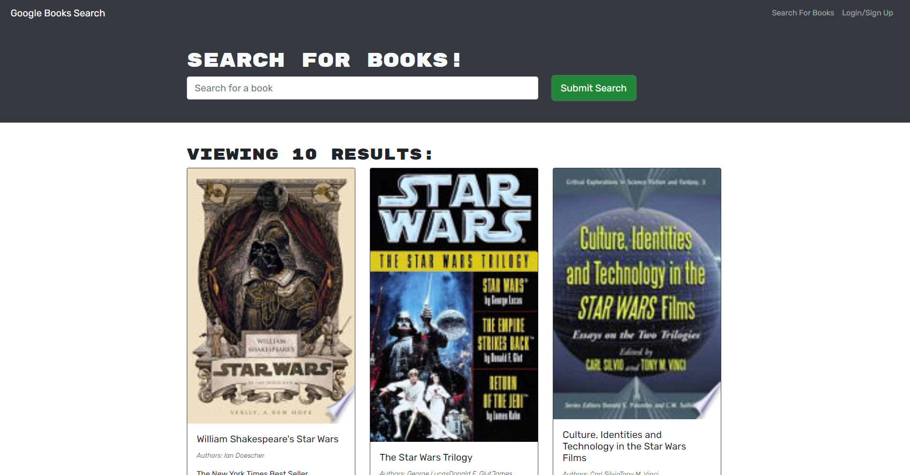
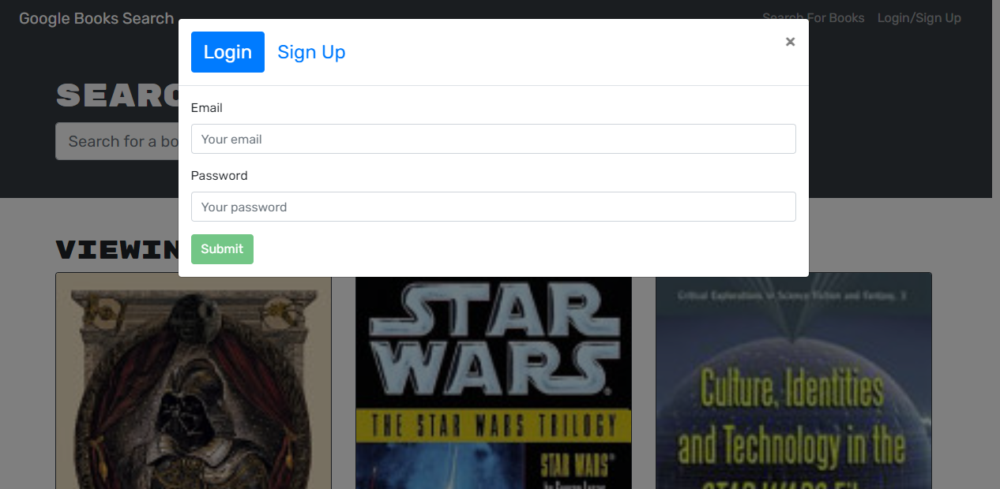

# Book-Search-Engine
fully functioning Google Books API search engine built with a RESTful API, and refactor it to be a GraphQL API built with Apollo Server. The app was built using the MERN stack, with a React front end, MongoDB database, and Node.js/Express.js server and API. It's already set up to allow users to save book searches to the back end.

## Table of Contents
* [Description](#description)
* [Installation](#installation)
* [Credits](#credits)
* [License](#license)

## Description
This application was built using the MERN stack, with a React front end, MongoDB database, and Node.js/Express.js server and API. It's already set up to allow users to save book searches to the back end. The application was refactored to use GraphQL API built with Apollo Server. 

## Installation
To install necessary dependencies, run the following command:
```NPM i```
followed by:
```NPM run build```
followed by:
```NPM start```
and finally:
```NPM run develop```

## Credits
Assitance with graphQl code was utilized from this author: https://github.com/apollographql/apollo-server/issues/4949
assitance wit graphQl code was utilized from this author: https://stackoverflow.com/questions/63189280/unable-to-resolve-module-for-apollo-client-version-3

Special thanks to Matt and Tom for the help on deployment

## Sceenshots




## License

MIT License

Copyright (c) 2023 amattock

Permission is hereby granted, free of charge, to any person obtaining a copy of this software and associated documentation files (the "Software"), to deal in the Software without restriction, including without limitation the rights to use, copy, modify, merge, publish, distribute, sublicense, and/or sell copies of the Software, and to permit persons to whom the Software is furnished to do so, subject to the following conditions:

The above copyright notice and this permission notice shall be included in all copies or substantial portions of the Software.

THE SOFTWARE IS PROVIDED "AS IS", WITHOUT WARRANTY OF ANY KIND, EXPRESS OR IMPLIED, INCLUDING BUT NOT LIMITED TO THE WARRANTIES OF MERCHANTABILITY, FITNESS FOR A PARTICULAR PURPOSE AND NONINFRINGEMENT. IN NO EVENT SHALL THE AUTHORS OR COPYRIGHT HOLDERS BE LIABLE FOR ANY CLAIM, DAMAGES OR OTHER LIABILITY, WHETHER IN AN ACTION OF CONTRACT, TORT OR OTHERWISE, ARISING FROM, OUT OF OR IN CONNECTION WITH THE SOFTWARE OR THE USE OR OTHER DEALINGS IN THE SOFTWARE.


